# DigitRecognizer

 

## Initial Canvas:
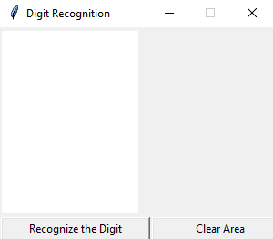

## Recognizing digits:
<table>
  <tr>
     <td>0</td>
     <td>1</td>
     <td>2</td>
  </tr>
  <tr>
    <td>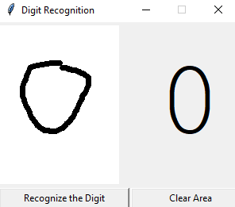</td>
    <td>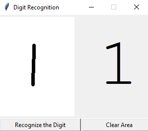</td>
    <td>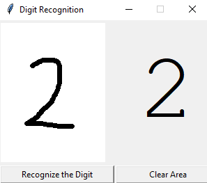</td>
  </tr>
 <tr>
     <td>3</td>
     <td>4</td>
     <td>5</td>
  </tr>
  <tr>
    <td>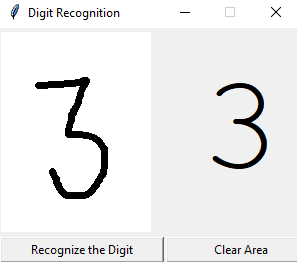</td>
    <td>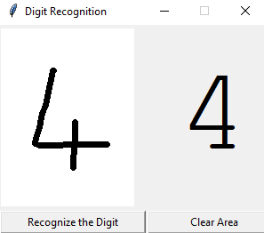</td>
    <td>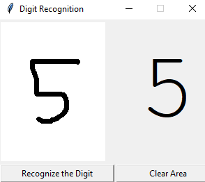</td>
  </tr>
 <tr>
     <td>6</td>
     <td>7</td>
     <td>8</td>
  </tr>
  <tr>
    <td>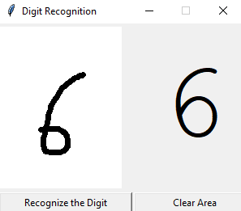</td>
    <td>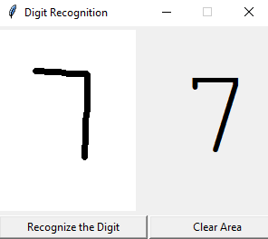</td>
    <td>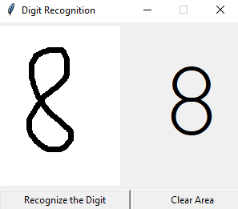</td>
  </tr>
 <tr>
     <td>9</td>
  </tr>
  <tr>
    <td>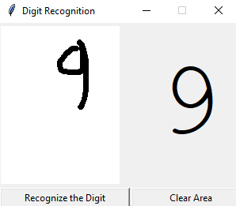</td>
  </tr>
 </table>
